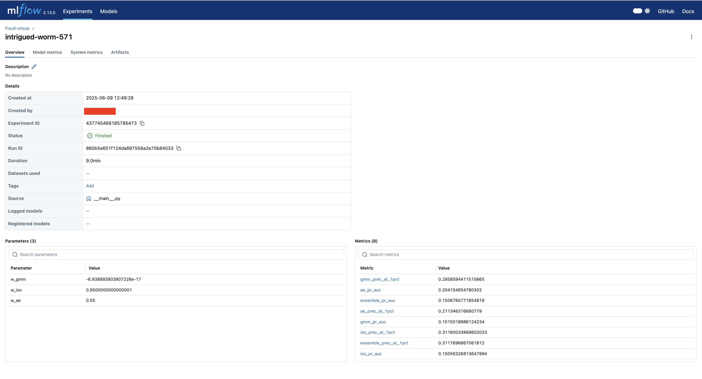
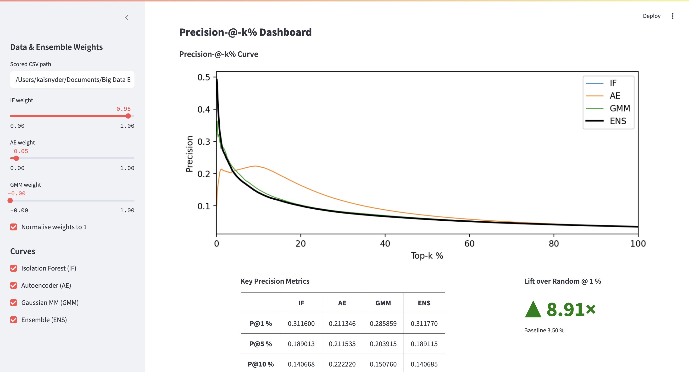

# Unsupervised Fraud-Detection Pipeline

A production-style, end-to-end pipeline for detecting credit-card fraud using the **IEEE-CIS fraud-detection dataset**.  
The project shows how to:

* Join / clean 1 GB+ raw tables
* Engineer temporal + high-cardinality categorical features
* Train three unsupervised detectors  
  * Isolation Forest  
  * Gaussian Mixture Model  
  * Auto Encoder (PyTorch)
* Grid-search ensemble weights to maximise **Precision @ 1 %**
* Track everything in **MLflow**
* Explore results with a **Streamlit dashboard** (precision-vs-k curves, precision table, lift metric)
* Package encoders + scalers so inference always matches train-time feature shape

---

## Repo Layout (abridged)
```text
fraud_detection_pipeline/
├── app/                  # Streamlit dashboard
│   └── streamlit_app.py
├── artifacts/            # run-time models & encoders
│   ├── config.yaml
│   └── models/{iso,gmm,ae,…}
├── data/
│   ├── raw/              # original Kaggle CSVs (git-ignored)
│   ├── interim/          # joined parquet
│   └── processed/        # cleaned parquet
├── scripts/              # helpers
├── src/
│   ├── cli.py            # python -m cli train|infer
│   └── fraud_unsup/      # importable package
│       ├── etl/          # join & clean
│       ├── features/     # encoders / scalers
│       ├── models/       # IF, GMM, AE wrappers
│       └── pipelines/    # train.py, infer.py
└── scored.csv            # sample scored output

---

````
## Quick-Start

bash
# 0) clone & create env
git clone <repo>
cd fraud_detection_pipeline
python -m venv .venv && source .venv/bin/activate
pip install -r requirements.txt

# 1) download IEEE-CIS data (needs Kaggle API key)
bash scripts/download_data.sh

# 2) train detectors + grid-search ensemble
python -m fraud_unsup train

# 3) open MLflow UI
mlflow ui &                     # http://127.0.0.1:5000

# 4) batch-score a file
python -m fraud_unsup.pipelines.infer data/processed/train.parquet --out_csv scored.csv

# 5) launch Streamlit dashboard
streamlit run app/streamlit_app.py
````

### What you should see

| Component     | URL              | What to look for                                                                              |
| ------------- | ---------------- | --------------------------------------------------------------------------------------------- |
| **MLflow**    | `localhost:5000` | Metrics such as `iso_prec_at_1pct`, `ensemble_prec_at_1pct`, saved model artifacts            |
| **Streamlit** | `localhost:8501` | Precision-vs-k curves (IF / AE / GMM / Ensemble), precision table, **Lift over Random @ 1 %** |

MLflow Output Example:


Streamlit Output Example:


---

## Technical Highlights

| Topic                   | Implementation                                                                                                           |
| ----------------------- | ------------------------------------------------------------------------------------------------------------------------ |
| **Feature engineering** | Rare-label grouping + frequency encoding for all card / addr / email columns; cyclic time features from `TransactionDT`. |
| **Model wrappers**      | `sklearn` Isolation Forest & GMM; PyTorch auto-encoder with BatchNorm + Dropout + early stopping.                        |
| **Ensemble search**     | Brute-force weight simplex (step 0.05) ⇒ maximise Precision @ 1 % on training labels.                                    |
| **Lift metric**         | Ensemble precision divided by dataset prevalence (\~3.5 %) → typically **> 8×**.                                         |
| **Reproducibility**     | All encoders & scalers saved under `artifacts/models/` so inference never hits a feature-mismatch.                       |
| **Dashboard UX**        | Weight sliders, curve toggles, non-breaking header & scaling fonts (CSS) so layout stays consistent at any zoom.         |

---

## Dataset License

Data © IEEE-CIS.
Original Kaggle competition: [https://www.kaggle.com/competitions/ieee-fraud-detection/data]

---

## Improvement Ideas

* ~~Grid-search weights~~
* Hyper-optimize Isolation Forest paramaters (Optuna)
* Concept-drift monitoring (Kolmogorov–Smirnov)
* FastAPI micro-service for real-time scoring
* Docker-compose with PostgreSQL sink

---

## Citation

If you use this template in academic work, please cite:

```
@misc{unsup_fraud_pipeline_2025,
  author       = {Snyder, Kai},
  title        = {Unsupervised Fraud Detection Pipeline},
  year         = 2025,
  howpublished = {\url{https://github.com/kaisnyder/fraud_detection_pipeline}}
}
```